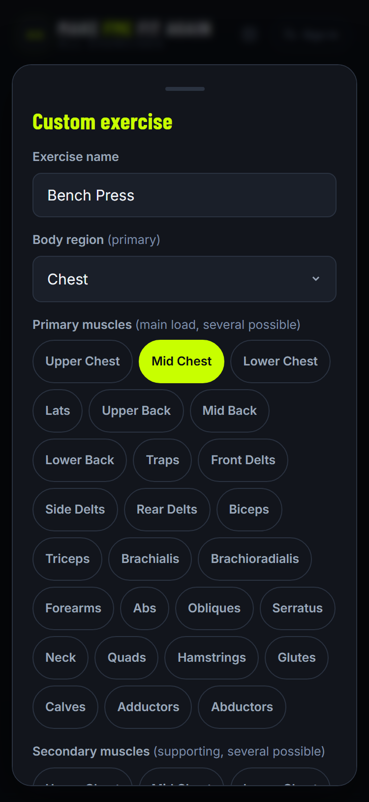
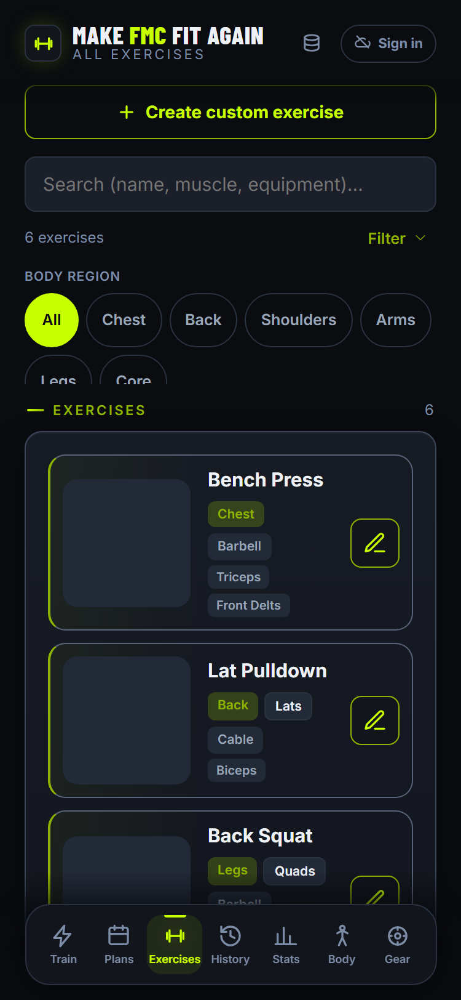
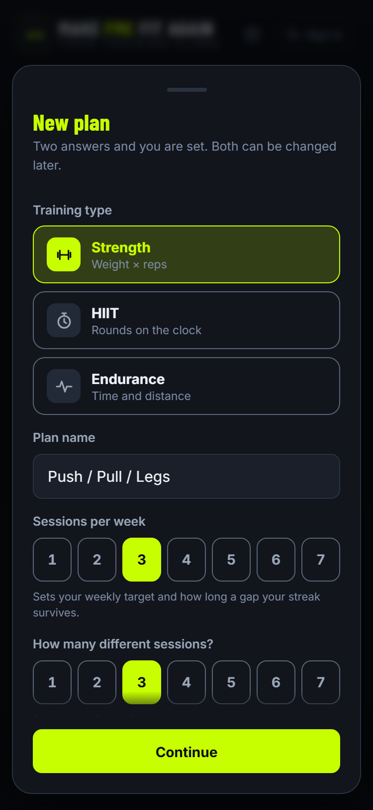
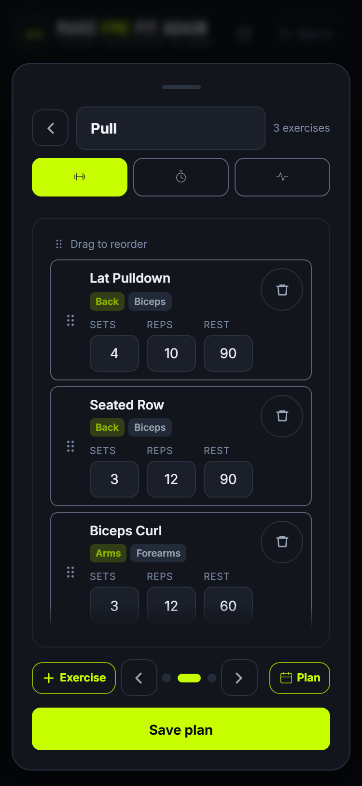
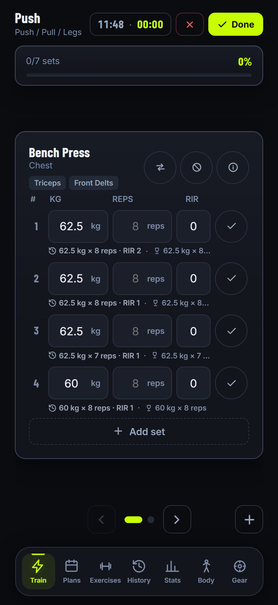
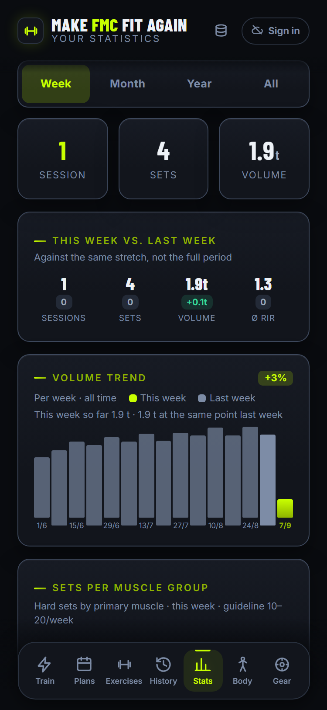

# Make FMC Fit Again — step by step

From an empty app to your first analysed workout.

The app starts **completely empty**: no exercises, no plans. That is deliberate —
you only ever enter what you actually do. Which means there is an order to
things, and the first three steps build on each other.

---

## Contents

| | Step | Required? |
|---|---|---|
| 1 | [Create exercises](#1-create-exercises) | **yes**, nothing works without them |
| 2 | [Set up your equipment](#2-set-up-your-equipment) | recommended |
| 3 | [Build a plan](#3-build-a-plan) | **yes** |
| 4 | [Train](#4-train) | the whole point |
| 5 | [After the workout](#5-after-the-workout) | happens by itself |
| 6 | [History and statistics](#6-history-and-statistics) | for looking back |
| 7 | [Body measurements](#7-body-measurements) | optional |
| 8 | [Backup and sync](#8-backup-and-sync) | **important** |

Also: [Glossary](#glossary) · [FAQ](#faq)

---

## Before you start

Open the app: **https://alexd0302.github.io/progresslab/**

On a phone it is worth adding the page to your home screen — it then launches
without a browser bar, like a real app.

**Where does my data live?** At first only in this one browser, on this one
device. Not in a cloud, not on a server. What that means and how to change it is
[step 8](#8-backup-and-sync). Read that one before you enter a lot.

There are seven tabs along the bottom:

`Train` · `Plans` · `Exercises` · `History` · `Stats` · `Body` · `Gear`

---

## 1. Create exercises

**`Exercises` tab**

No exercises, no plan. No plan, no workout. So start here.

On first launch it says *"No exercises yet"*. Tap
**`+ Create custom exercise`**.

### The form

   
  The form for a custom exercise

| Field | What goes in |
|---|---|
| `Exercise name` | The name you will see while training. Be specific: "Close-Grip Bench Press" beats "Bench 2". |
| `Body region (primary)` | One of six: Chest, Back, Shoulders, Arms, Legs, Core. Filtering and grouping run off this. |
| `Primary muscles` | What does the main work. Several allowed. |
| `Secondary muscles` | What assists. Several allowed. Use `New` to add a muscle of your own if yours is missing. |
| `Equipment` | Barbell, Dumbbell, Machine, Cable, Bodyweight, Kettlebell, EZ bar, No equipment, Other. **Remember your choice** — step 2 hangs off it. |
| `Number of dumbbells` | Appears **only** for `Dumbbell`. See the note below. |
| `Bench (optional)` | Free text, e.g. "30° incline". Just a reminder for you. |
| `Image, GIF or video` | `Upload file` or `Web link`. An image, a GIF **or** a short video (mp4, webm, mov) — videos loop. |
| `How-to` | One line per step. You reach it later through the ⓘ next to the exercise. |

Then **`Save exercise`**.

> **On dumbbell count:** with two dumbbells you enter the weight of **one** while
> training. The app doubles it internally for volume and records. You never have
> to do that maths yourself.

> **On images:** keep them under 1.5 MB. Browser storage is tight, and oversized
> images are the most common reason it fills up.

### How many to start with?

   
  The exercise list with six exercises created

Create the exercises for your first workout — typically five to eight. The rest
can follow later; you can add exercises at any time, including mid-plan.

To change an exercise, tap it in the list. Your own exercises carry a pencil icon.

---

## 2. Set up your equipment

**`Gear` tab**

Optional, but it is what makes the weight suggestions usable.

The tab lists the seven equipment types where weight matters: Barbell, Dumbbell,
Machine, Cable, EZ bar, Kettlebell, Other. (Bodyweight and No equipment are
absent — there is nothing to set there.)

**The problem it solves:** with nothing entered, the app works off a fixed
increment. It will suggest 42.5 kg when your dumbbell rack only does 40 or 45.

Tap an equipment type and enter **the weights it can actually be set to**. Two
ways:

- **`Range`** — from / to / step. For machines with an even ladder.
  Example: from `4`, to `40.5`, step `1.5`.
- **`List`** — weights separated by semicolons. For racks with gaps.
  Example: `5; 10; 15; 20; 30`.

After that, suggestions only ever land on weights you actually own. At the top of
the range the app tells you to carry on with reps instead.

---

## 3. Build a plan

**`Plans` tab** → **`+ New plan`**

The builder has three screens. The first asks two questions and nothing more.

### Screen 1 — the frame

   
  Screen 1: training type, name, frequency

**`Training type`** — this decides what training looks like later:

| Type | Subtitle | You record |
|---|---|---|
| **`Strength`** | Weight × reps | weight, reps and RIR per set |
| **`HIIT`** | Rounds on the clock | rounds, work, rest — the app counts |
| **`Endurance`** | Time and distance | duration, distance, heart rate |

**`Plan name`** — e.g. "Push / Pull / Legs".

**`Sessions per week`** (1–7) — your weekly target. This number is **not just
decoration**: it drives the weekly bar on the home screen and decides how long a
gap may be before your streak breaks. At 3× a week the app forgives more time off
than at 6×.

**`How many different sessions?`** (1–7) — how many *distinct* sessions the plan
has. For Push/Pull/Legs that is 3. They start out named "Day A", "Day B", "Day C".

> `Sessions per week` and `How many different sessions?` are two different
> things. Three sessions can run four times a week — you just rotate through them.

Then **`Continue`**.

### Screen 2 — overview

Shows the name, the weekly target and every session. Tap a session to fill it.

### Screen 3 — fill a session

   
  Screen 3: the "Pull" session with three exercises

At the top the name (tap it: "Day A" → "Push"), on the right the exercise count.
Below that three icons: these give **this one session** a different type from the
plan. So a strength plan may contain a HIIT day.

**`+ Exercise`** at the bottom left opens the picker. Search there, or filter by
body region and equipment. Only exercises you created in step 1 show up.

Per exercise you set:

| Field | Meaning |
|---|---|
| `Sets` | number of sets |
| `Reps` | target reps — they appear as a faint hint while training |
| `Rest` | pause in seconds; starts the timer once you tick a set |

To reorder, grab an exercise and drag it.

For **HIIT** sessions you get `Rounds`, `Work` and `Rest` instead of sets.
Underneath, the app keeps totalling the duration, e.g.
`4 × 5 × (40s + 20s) = 20 min`.

**`Plan`** at the bottom right takes you back to the overview to fill the next
session. When you are finished, **`Save plan`**.

---

## 4. Train

**`Train` tab**

At the top sit `Current streak` and `This week` with your progress against the
weekly target, e.g. `0 / 3`.

Below that the suggestion for your next session: a large **`Start with`** button
carrying the session name and its exercises. Tap it to begin.

Want a different one? **`Other session`** lists every session in the plan.

> **`Free workout`** starts without a plan — for days when you just do something.
> It counts towards history and statistics exactly the same.

### The training screen

   
  The training screen with the weight pre-filled

At the very top: the time of day and the **workout duration**, which runs along
and gets saved with the session. On the right `✕ Cancel` and `✓ Done`.

Below that the exercise with its image, then the sets. Three fields per set:

- **kg** — with two dumbbells, the weight of *one*
- **reps** — reps you completed
- **RIR** — how many more you could have done (0 = nothing left)

The weight from last time is **already filled in**. Usually you only type the reps.

The tick on the right marks a set done. That starts the rest timer, provided you
gave the exercise a rest value. `Skip` cuts it short.

Under each set sits a line with two facts:

- 🕘 **last time** — weight × reps, plus RIR
- 🏆 **record** — your best mark at that rep count

Beat the record and the line turns green and says `beaten`.

**`+ Add set`** appends a set on the spot. Swipe to change exercise; the dots at
the bottom show where you are.

Three icons sit at the top right of the card:

| Icon | What it does |
|---|---|
| ⇄ | Swap this exercise for another — for when a machine is occupied |
| ⊘ | Skip it for today (see below) |
| ⓘ | Show the how-to you wrote |

### Changing your mind mid-session

Nothing about a session is fixed once it has started, and none of it touches
your saved plan.

**Add an exercise at any time** with the **`+`** at the right end of the dots
row. It lands at the end of the session with fresh sets, and you jump straight
to it. Useful when you still have something in the tank — or when you simply
feel like doing more.

**Leave one out** with the **⊘** on the card. The exercise stays visible but
greyed out, saying `Skipped for today`, and **`Bring back`** undoes it. A
skipped exercise:

- no longer counts towards your progress, so `6/6 sets · 100 %` is reachable
  without doing it;
- never reaches your history — it is as if you had not planned it today.

If you already ticked sets on it, the app asks first, because those sets will
not be saved.

The dot for a skipped exercise is drawn hollow, so you can see at a glance while
swiping that something was left out.

Nothing is written until you press `✓ Done`.

---

## 5. After the workout

You get a summary — not a toast that flies past:

- how long the session took
- sets and total volume
- **comparison against last time** for the same session, as two bars with a percentage
- **every new record**, one line per exercise
- your streak

If no record fell, that block is simply absent — it never says "no records".

If it is the first session of its kind there is no comparison bar; you get the
plain number rather than "−100 %".

---

## 6. History and statistics

**`History` tab** — a month calendar. Days with a workout are marked; tap one to
see that day's sessions.

To correct something afterwards, use **`Edit workout`** — the button sits at the
bottom of the workout and stays there while you scroll. The editor opens at
whichever exercise you were looking at, so you rarely have to scroll twice.

There you can change every individual set, add what you forgot with `Add set` or
`Add exercise`, and save with **`Save changes`**. Session name and date hide
behind the compact line at the top; tap it to open them. Records and statistics
recalculate afterwards.

**`Stats` tab** — the range picker sits at the top: **`Week` · `Month` · `Year` · `All`**.

   
  Statistics: key figures, weekly comparison and volume trend

Worth knowing: the picker controls the **key figures and comparisons**. The
**volume chart always shows your entire history** — first workout to today. The
chosen range is only highlighted within it. That way you see the whole
development without cutting off the beginning. The interval adapts: weeks up to
about four months, then months, and years past roughly three.

Below that sits **progress per exercise**, alphabetical. For each exercise you can
switch what progress is measured by:

| Measure | Meaning | Good for |
|---|---|---|
| **`Volume`** (default) | weight × reps, summed over the session | total workload |
| **`Top set`** | heaviest single set | raw strength |
| **`1RM`** | estimated one-rep max, Epley: `kg × (1 + reps/30)` | comparing across different rep counts |

> A word on honesty: volume can rise because you did more sets, not because you
> got stronger. If you want to know whether you are *stronger*, look at `Top set`
> or `1RM`. The most telling thing is to flick through all three — if they climb
> together, it is real.

---

## 7. Body measurements

**`Body` tab**

Twelve sites plus body weight: Shoulders, Chest, Biceps left/right, Forearm
left/right, Waist, Hips, Thigh left/right, Calf left/right. Each carries a note on
where exactly to measure — "Waist: narrowest point, usually above the navel".
Stick to it, or you will measure somewhere else next time and the trend is
worthless.

You do not have to fill everything in. Three values taken consistently every four
weeks say more than twelve values taken once.

Under `Trend` you follow one site across all measuring days.

---

## 8. Backup and sync

**This is the step people regret skipping.**

Your data lives in your browser's storage. Clear browsing data, use a private
window, switch phones — and it is gone. There are two safety nets, and they solve
different problems.

### Backup file (the gear icon, top right)

**`Data & backup`** → **`Download backup`** writes a JSON file with everything:
exercises, plans, workouts, measurements.

**`Restore backup`** reads it back.

Do this **now**, as soon as your exercises and first plan exist, and roughly
monthly after that. Put the file somewhere that is itself backed up — OneDrive,
Google Drive, anywhere but the download folder of the same device.

### Account (`Sign in`)

An account syncs between devices — phone and wall panel show the same data, and
syncing runs in the background. Sign up with an email address and a password (at
least 6 characters).

The app works **fully without an account**. Sync is an addition, not a
requirement. You can train offline as normal; the app catches up once it has a
connection again.

> An account and a backup file do **not** replace one another. The account covers
> "my phone broke", the file covers "I deleted everything by accident". Use both.

---

## Glossary

| Term | Meaning |
|---|---|
| **RIR** | *Reps in reserve* — how many more reps you could have done. 0 = failure, 2 = two left in the tank. The most honest measure of how hard a set was. |
| **Volume** | Weight × reps, summed up. For bodyweight exercises the app counts reps instead. |
| **Top set** | The heaviest single set of a session. |
| **1RM** | Estimated weight for exactly one rep, by Epley: `kg × (1 + reps/30)`. An estimate, not a measurement. |
| **Record** | Your best mark — kept **per rep count**. 100 kg × 5 and 80 kg × 12 are two separate records; neither beats the other. |
| **Streak** | Consecutive weeks in which you hit your weekly target. |

---

## FAQ

**I have no exercises and cannot find a database.**
Correct, there is none bundled. You create every exercise yourself. That is
deliberate — the list stays as short as your actual training.

**Can I change a plan later?**
Yes. `Plans` → tap the plan → `Edit`. Workouts already saved stay as they were.

**I typed the wrong weight and already ticked the set.**
`History` → tap the day → `Edit workout` → fix the value → `Save changes`.
Records and statistics recalculate.

**I still have energy left at the end of a session.**
Use the `+` at the right of the dots row — it works at any point, not only at
the end. The session carries on and only closes when you press `✓ Done`.

**A machine is occupied, or I just do not want an exercise today.**
Either swap it (⇄) or skip it (⊘). A skipped exercise stops counting towards
your progress and stays out of your history; `Bring back` undoes it. Your plan
is unchanged either way — both decisions apply to this one session.

**Why did my volume drop?**
Usually fewer sets, not less strength. Switch that exercise to `Top set` under
`Stats` — if that holds steady, nothing is wrong.

**An exercise image will not load.**
With `Web link` the address has to point straight at the image file, not at a
page containing it. When in doubt use `Upload file`.

**Storage is full.**
Almost always uploaded images. Download a backup, then remove or shrink the
images on individual exercises.

**Does a cancelled workout count?**
No. `✕ Cancel` discards the session entirely. Only `✓ Done` saves it.
